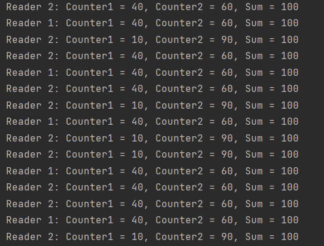
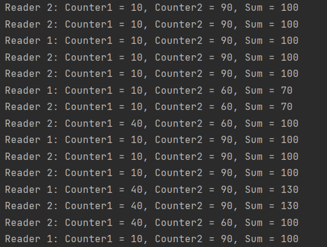

# Task to solve

Create 2 writers and 2 readers services with different
period of launching. Writers periodically change two
counters the sum of which always should be 100. The readers
show that counter’s value. Prove that without synchronization the sum of two
counters is not always 100.

# Get started

### Clone the repo

```
git clone git@github.com:danielyandev/python-lock-test.git
```

### Install requirements

```
pip install -r requirements.txt
```

### Prepare environment

Prepare .env file

```
cp .env.example .env
```

Prepare counter files

```
cp counter.txt.example counter1.txt
cp counter.txt.example counter2.txt
```

Set USE_FILE_LOCK variable in .env file one of these values:
{true, 1} to use file locking, otherwise operations with file
will be performed without locking

### Run the script

```
python main.py
```

# Results

Running script with and without locking,
we can see different results

### With locking

Using locks will result in having correct result: each
time the sum will be equal to 100, because files are locked
during write/read processes and no other process can access it.



### Without locking

If we don't use locks we face such cases when file was overwritten
by 2 processes simultaneously and the final result can't be predicted.




# Conclusion

Without synchronization the sum of two counters is not
always 100. To have predictable results in multithreading
applications, it is important to use file locking.